# Architecture Documentation

## System Overview

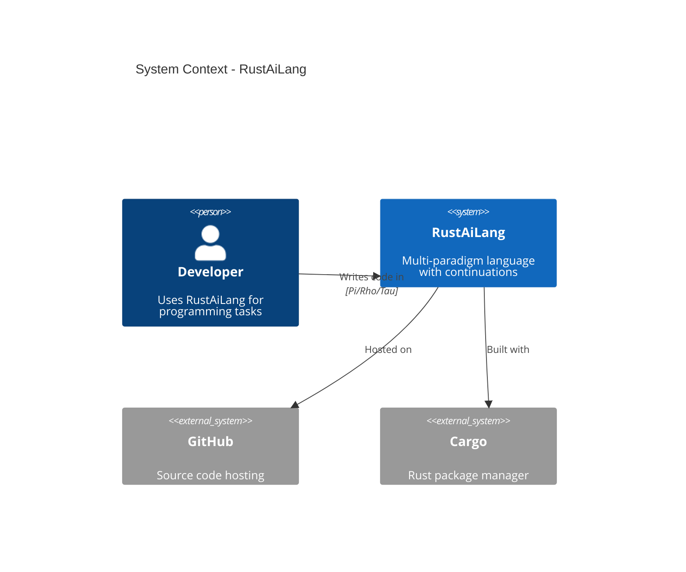

## Component Architecture

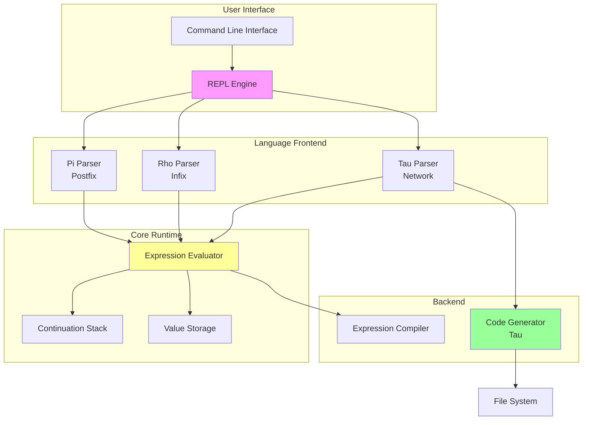

## Data Flow

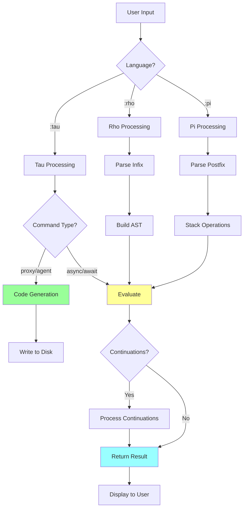

## Module Structure

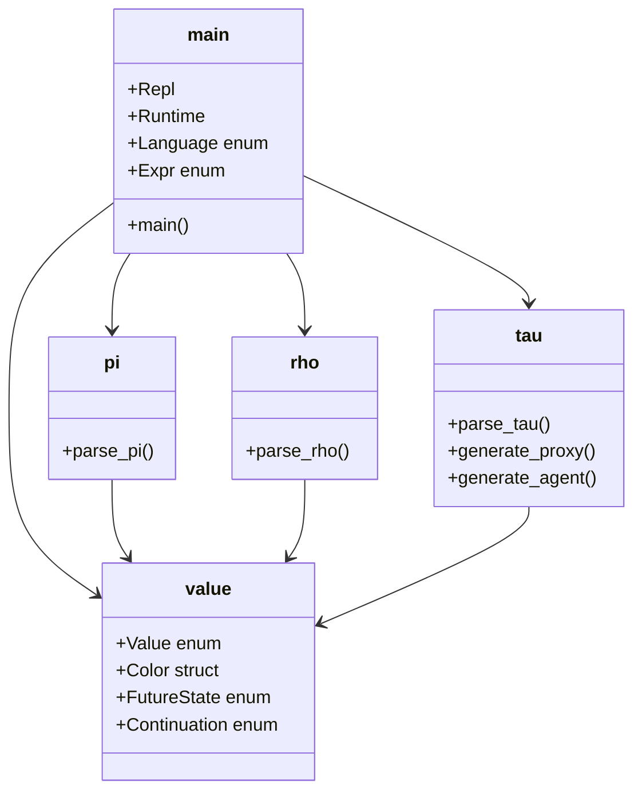

## Expression Evaluation Pipeline

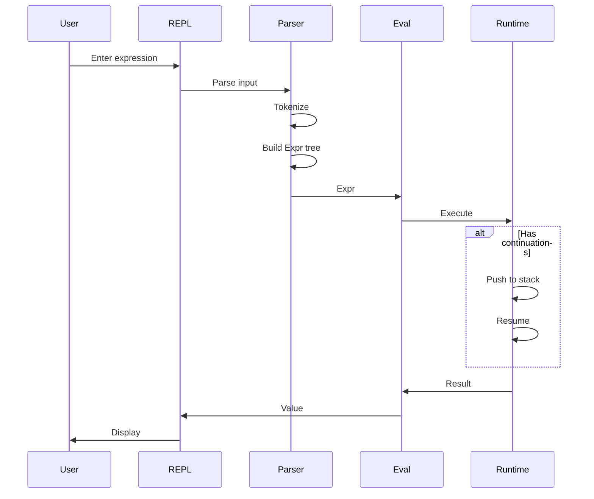

## Continuation Stack Model

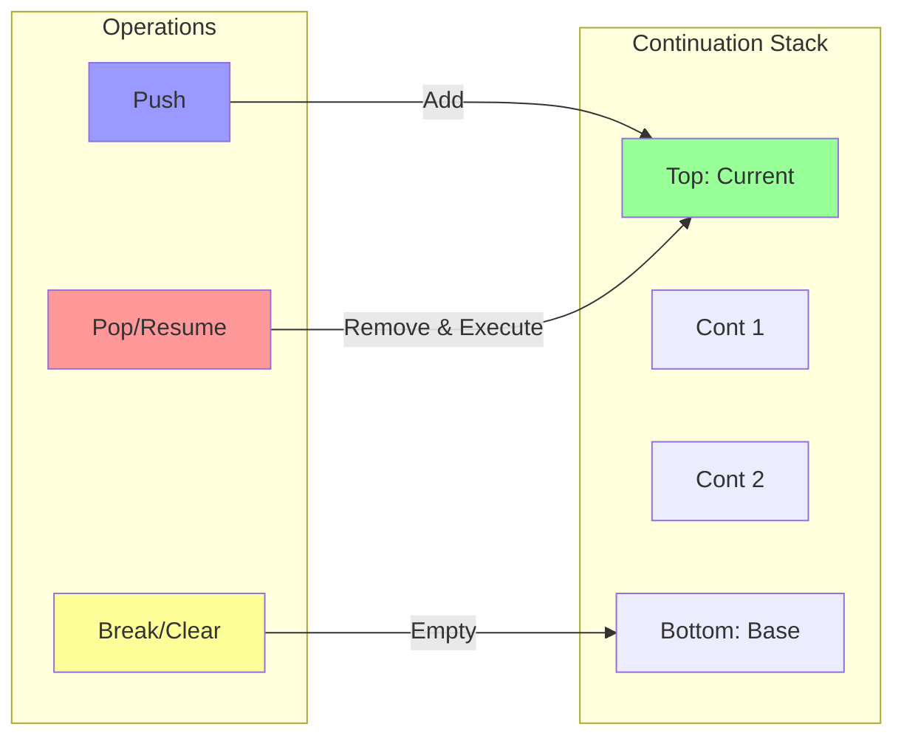

## Value Type Hierarchy

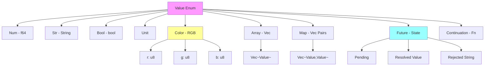

## Loop Execution Model

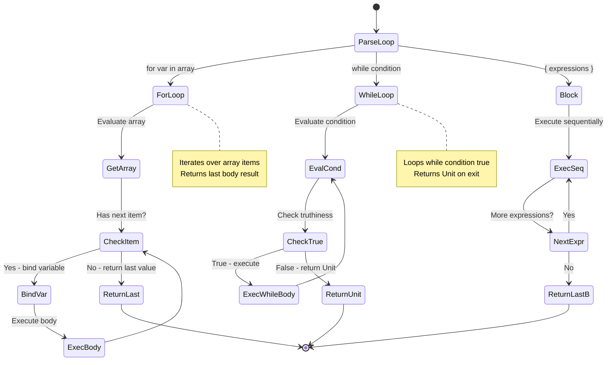

## Tau Code Generation Flow

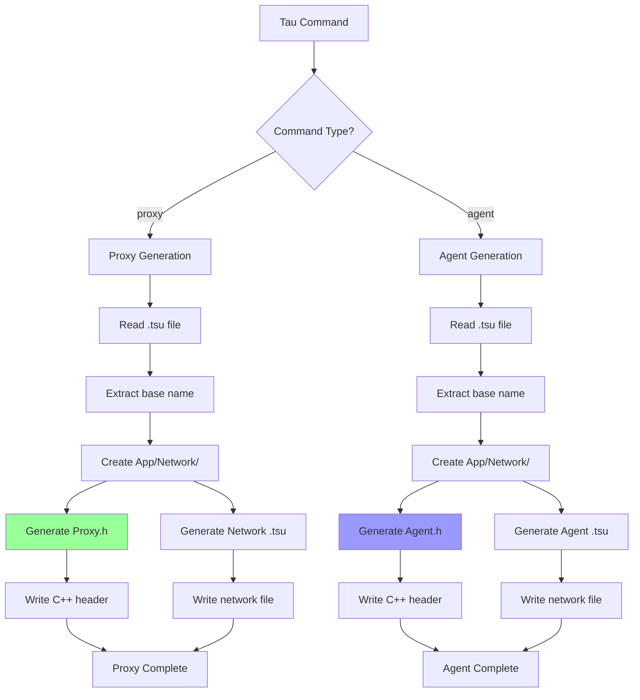

## Memory Management

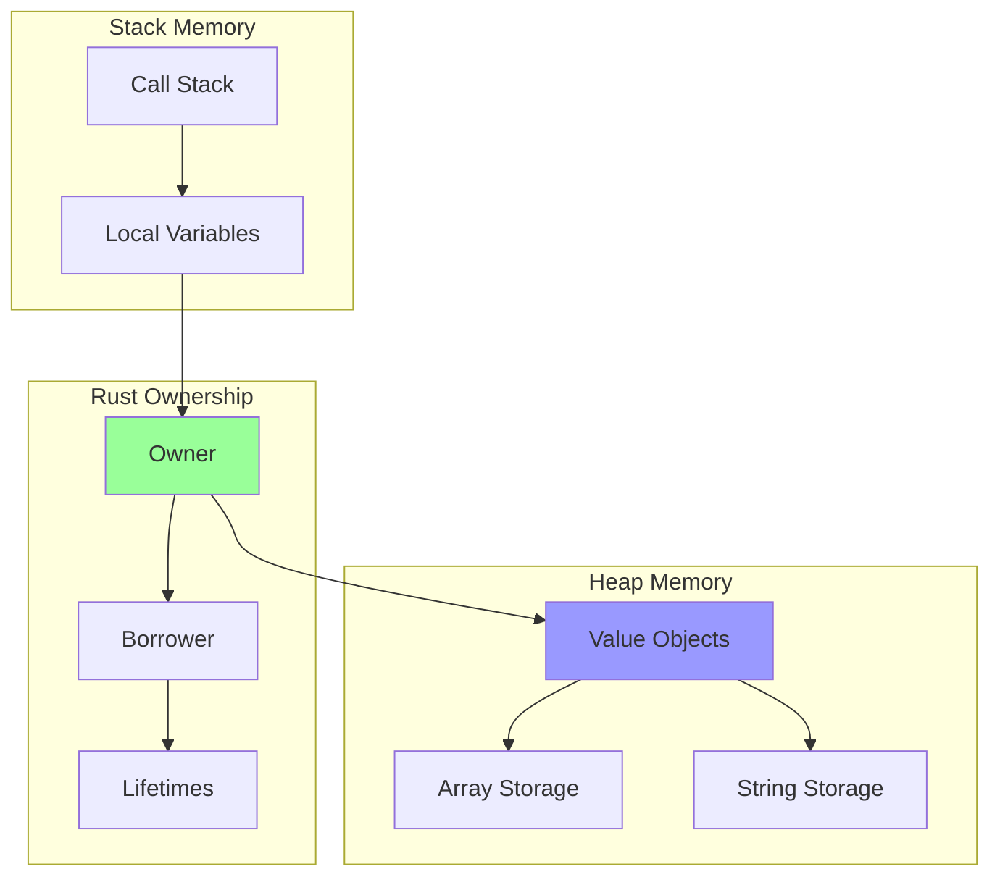

## Error Handling Flow

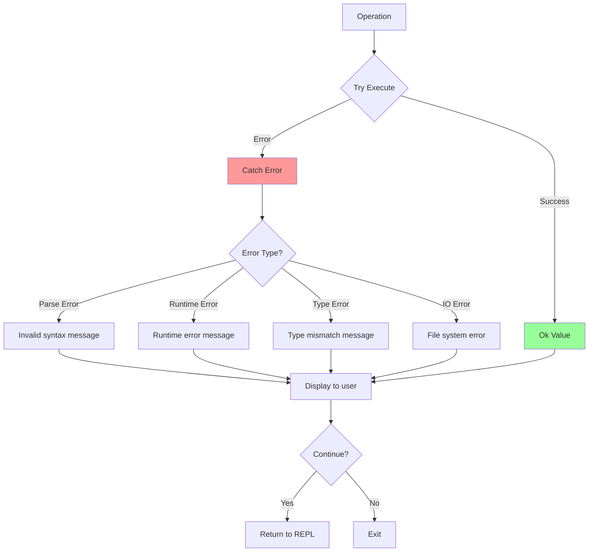

## Performance Profile

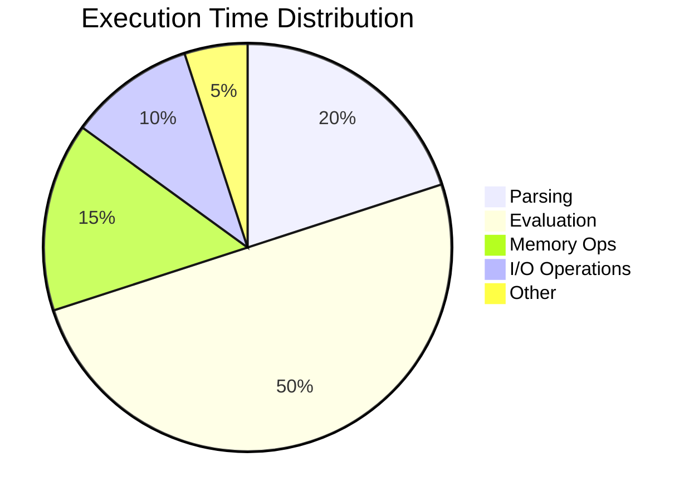

## Concurrency Model

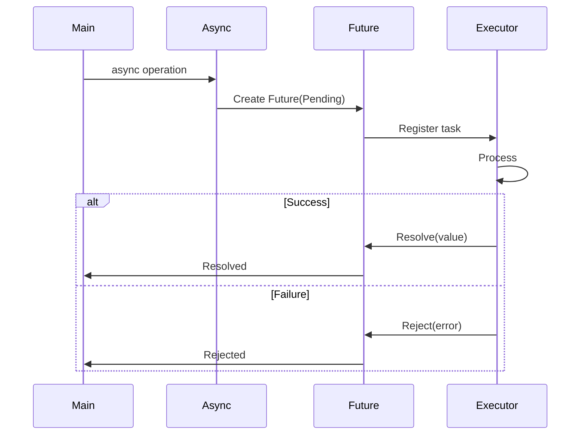

---

**Document Version:** 1.0
**Last Updated:** 2025
**Status:** Current Architecture
