# RustAiLang - Multi-Paradigm Language System

## Project Goal

Create a language system with native continuations, featuring three distinct dialects optimized for different computational paradigms.

## Architecture

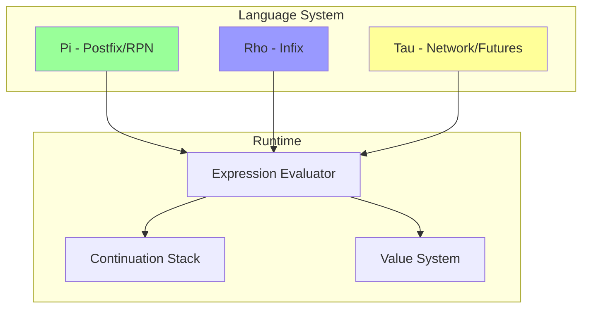

## Implementation Language

**Rust** - For memory safety, performance, and strong type system

## Key Features

### 1. Native Continuations

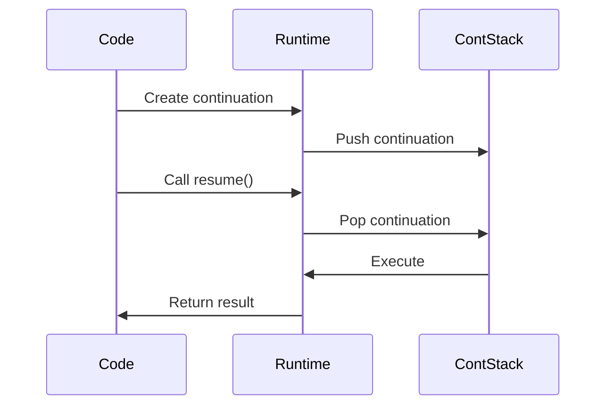

**Operations:**
- `resume` - Execute what's on the continuation stack
- `break` - Drop continuation stack and resume next
- `continue(f)` - Takes a continuation argument and executes it

### 2. Three Language Dialects

#### Pi (Postfix/RPN)
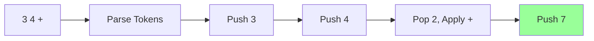

**Characteristics:**
- Stack-based evaluation
- Postfix notation (operators follow operands)
- Left-to-right execution
- File extension: `.pi`

#### Rho (Infix)
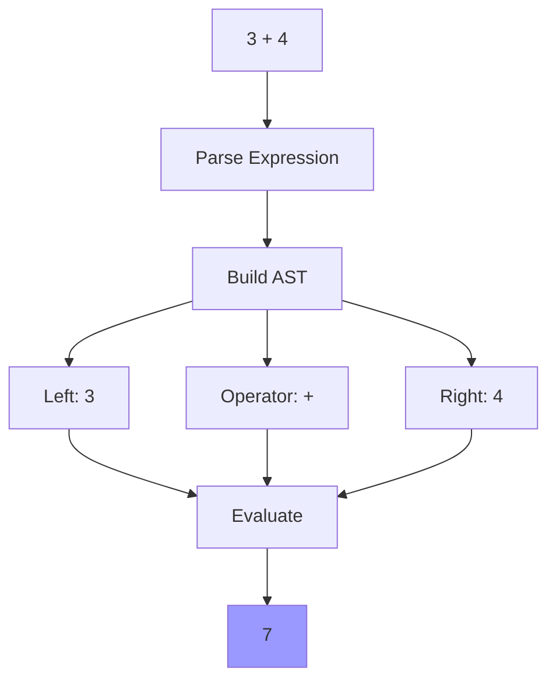

**Characteristics:**
- Traditional infix notation
- Operator precedence
- Tab-based scoping
- File extension: `.rho`

#### Tau (Network/Futures)
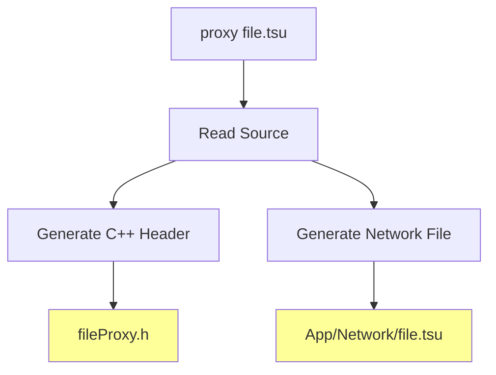

**Characteristics:**
- Async/await operations
- Code generation (Proxy/Agent patterns)
- Cross-language integration
- File extension: `.tsu`

### 3. Loop Constructs

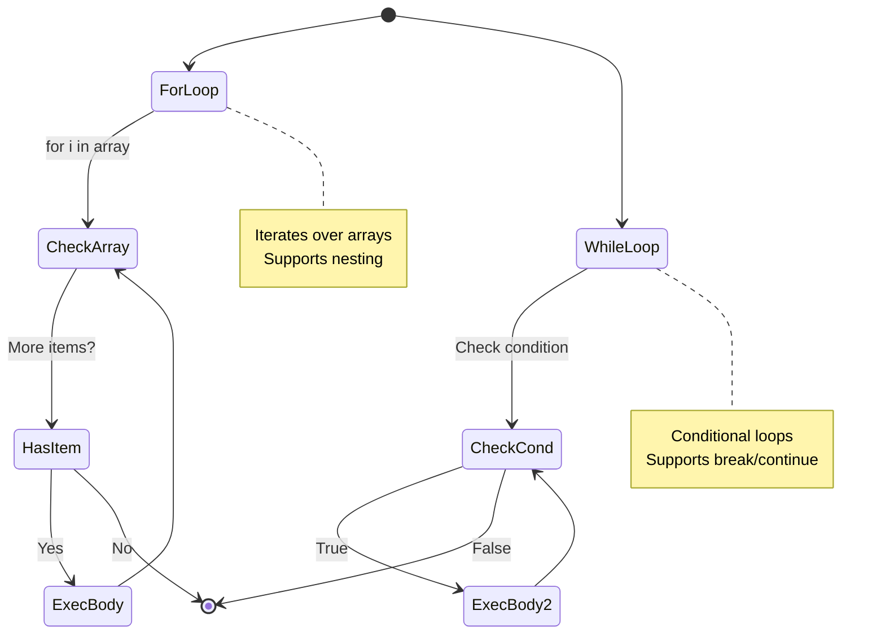

### 4. Value System

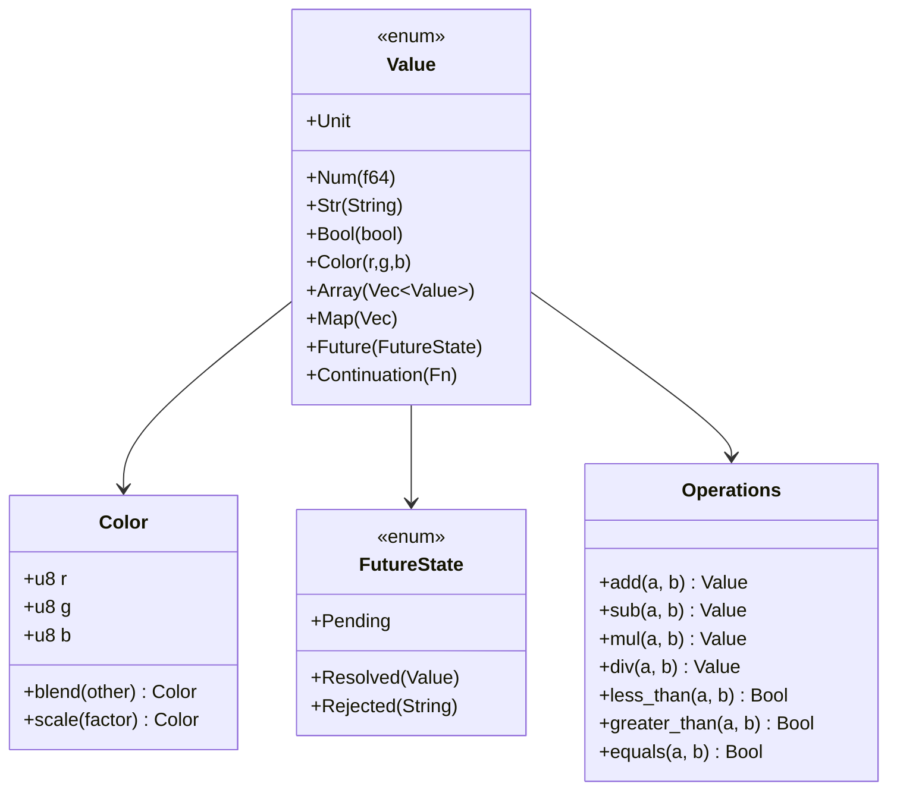

## Testing Strategy

### Test Coverage: 100 Tests

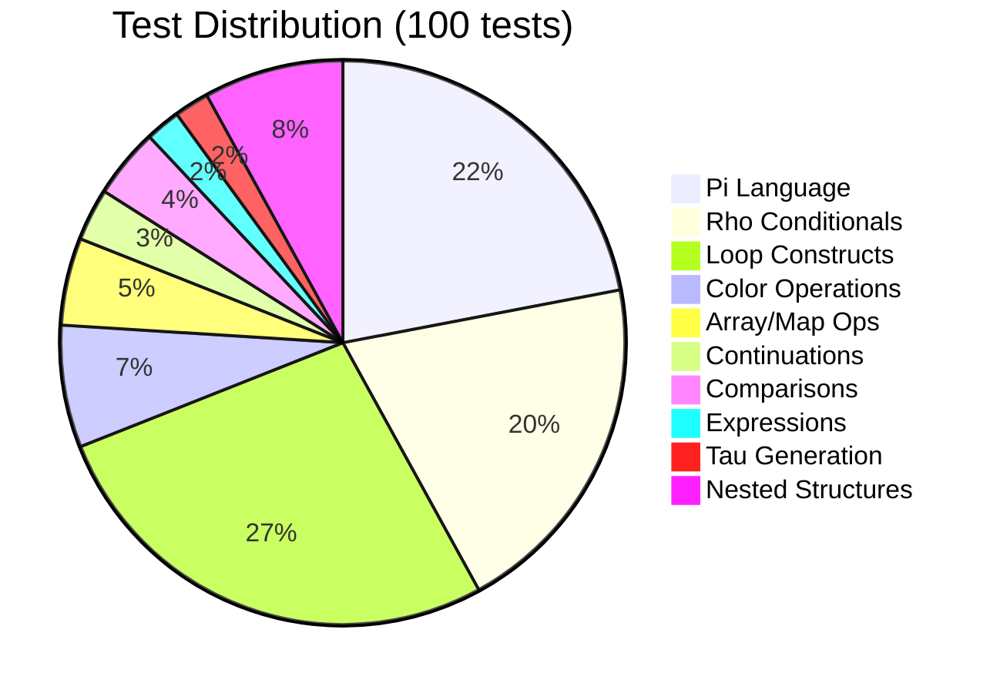

### Test Categories

1. **Pi Language (22 tests)**
   - Basic arithmetic operations
   - Complex nested expressions
   - Edge cases (negatives, zero, large numbers)
   - Float precision handling

2. **Rho Conditionals (20 tests)**
   - Comparison operators (<, >, ==)
   - Boolean logic
   - String comparisons
   - Truthiness evaluation

3. **Loop Constructs (27 tests)**
   - For loops with arrays
   - While loops with conditions
   - Nested loops (2-5 levels)
   - Block expressions
   - Mixed structures

4. **Tau Generation (2 tests)**
   - Proxy generation with file verification
   - Agent generation with file verification

## Development Workflow

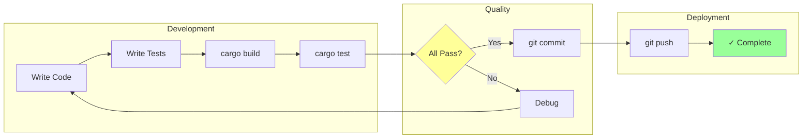

## Project Structure

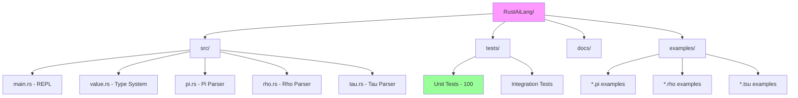

## Build & Test Commands

```bash
# Build project
cargo build              # Debug build
cargo build --release    # Optimized build

# Run tests
cargo test              # All 100 tests
cargo test pi_          # Pi language tests only
cargo test rho_         # Rho language tests only
cargo test tau_         # Tau language tests only
cargo test loop_        # Loop tests only

# Run REPL
cargo run

# Run with file
cargo run < program.pi
cargo run < program.rho
cargo run < program.tsu
```

## Version History

### v0.4.0 (Current)
- ✅ 100 comprehensive tests
- ✅ For/while loops with nesting
- ✅ Comparison operators
- ✅ Block expressions
- ✅ Tau code generation

### v0.3.0
- ✅ Loop structures added
- ✅ 40 tests passing
- ✅ Nested loop support

### v0.2.0
- ✅ Three languages (Pi, Rho, Tau)
- ✅ 27 tests passing
- ✅ Basic operations

### v0.1.0
- ✅ Initial implementation
- ✅ Continuation system
- ✅ Basic value types

## Future Enhancements

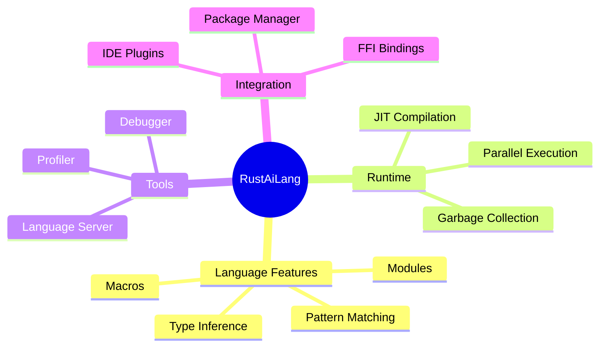

## Contributing

See [README.md](README.md) for contribution guidelines.

## License

See LICENSE file for details.

---

**Status:** ✅ Production Ready
**Tests:** 100/100 passing
**Languages:** Pi, Rho, Tau
**Version:** 0.4.0
