# Three Languages - Pi, Rho, Tau

A multi-paradigm language system with three dialects, each optimized for different computational paradigms.

## Architecture Overview

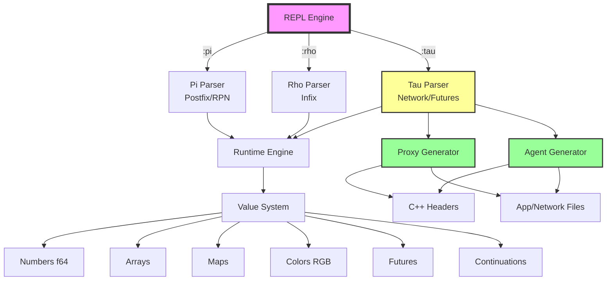

## File Extensions
- Pi (postfix): `.pi`
- Rho (infix): `.rho`
- Tau (network): `.tsu`

## Language Selection Flow

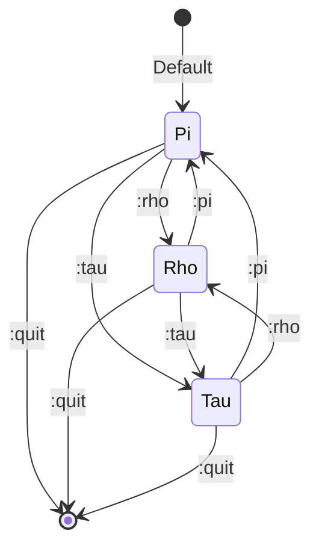

## The Three Languages

### Pi - Postfix/RPN Notation

Stack-based postfix language (Reverse Polish Notation):

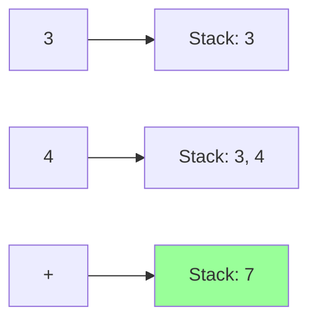

**Examples:**
```
3 4 +              # 7 (postfix addition)
5 10 *             # 50 (postfix multiplication)
[1,2,3] "arr" =    # Variable assignment (postfix)
arr -->            # Stack operation: prints "1 2 3"
```

**Execution Model:**
- Values pushed onto stack
- Operators pop operands, push results
- Left-to-right evaluation

### Rho - Infix with Tab Indentation

Traditional infix notation with tab-based indentation:

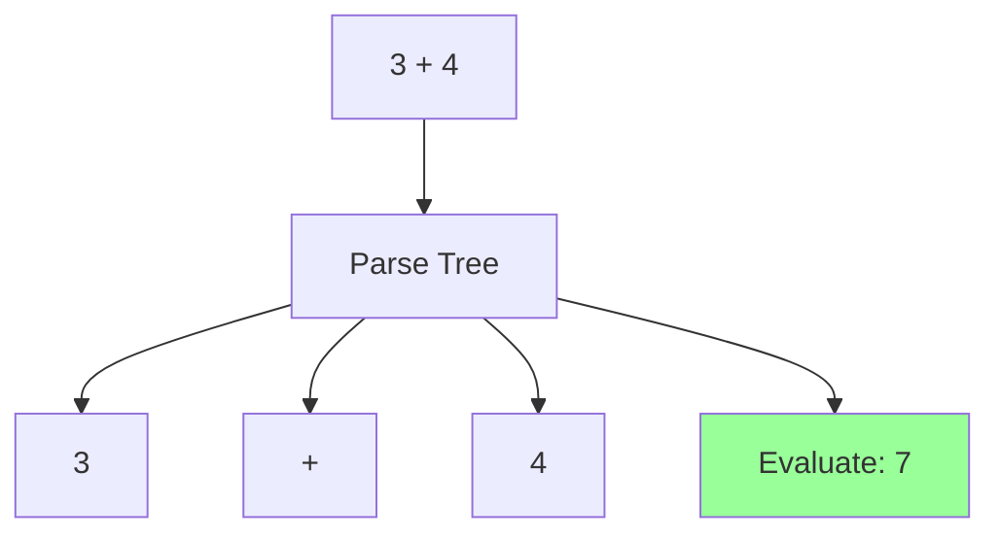

**Examples:**
```
3 + 4              # 7 (infix addition)
5 * 10             # 50 (infix multiplication)
arr = [1,2,3]      # Variable assignment (infix)
if a == 1          # Uses tabs for block structure
	doSomething
```

**Features:**
- Natural mathematical notation
- Operator precedence
- Tab-based scoping

### Tau - Network Language with Futures

Asynchronous network operations with code generation:

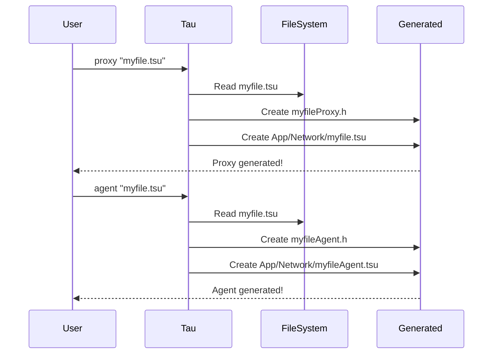

**Examples:**
```
async fetch        # Returns Future(Pending)
await result       # Resolves Future
proxy "file.tsu"   # Generates proxy wrapper for file
agent "file.tsu"   # Generates autonomous agent for file
```

**Generated Structure:**
```
proxy "mycode.tsu" creates:
├── myCodeProxy.h              # C++ proxy header
└── App/Network/mycode.tsu     # Network implementation

agent "mycode.tsu" creates:
├── myCodeAgent.h              # C++ agent header
└── App/Network/mycodeAgent.tsu # Async wrapper
```

## Switching Languages

Use REPL commands to switch between languages:
- `:pi` - Switch to Pi (postfix/RPN)
- `:rho` - Switch to Rho (infix+tabs)
- `:tau` - Switch to Tau (network+futures)

## Common Features

### Value Type System

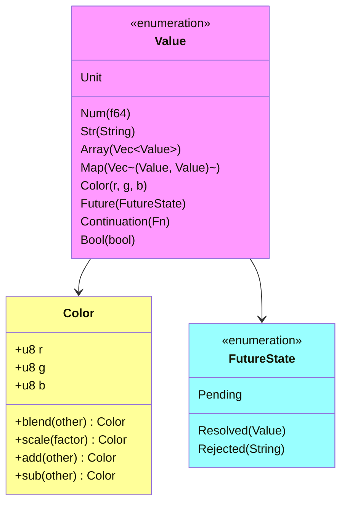

### Numeric Type (f64)
All numbers are 64-bit floating point

### Arrays `[...]`
```
[1,2,3]
[1,2] + [3,4]  # Concatenation
```

### Maps `[{key,value},...]`
```
[{1,10},{2,20}]
[{"x",100},{"y",200}]
```

### Strings `"text"`
```
"hello"
'world'
```

### Array/Map Indexing
```
[10,20,30][1]           # 20
[{"x",100}]["x"]        # 100
```

### Colors `color(r,g,b)`

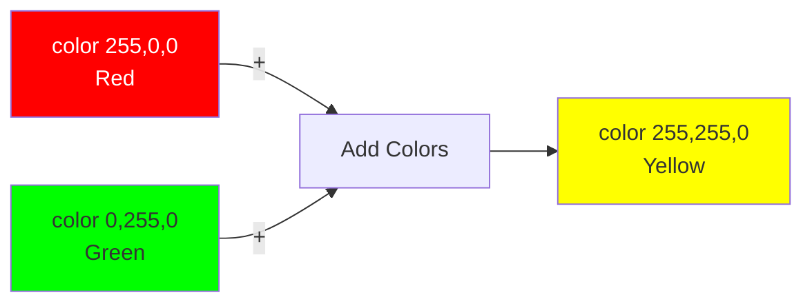

**Examples:**
```
color(255,0,0)                      # Red
color(255,0,0) + color(0,255,0)     # Yellow (additive)
color(200,100,50).blend(color(100,200,150))  # Blended color
```

### Bash Injection `` `command` ``
```
`echo Hello`
`pwd`
`ls -la`
```

### Control Flow
- `resume` - Execute continuation stack
- `break` - Drop continuation stack
- `continue` - Takes continuation argument

### Comments
```
# This is a comment
```

## REPL Commands
- `:quit` or `:q` - Exit
- `:help` or `:h` - Show help
- `:pi` - Switch to Pi
- `:rho` - Switch to Rho
- `:tau` - Switch to Tau

## Running Files
```bash
cargo run < program.pi   # Pi files
cargo run < program.rho  # Rho files
cargo run < program.tsu  # Tau files
```

## Data Flow Example

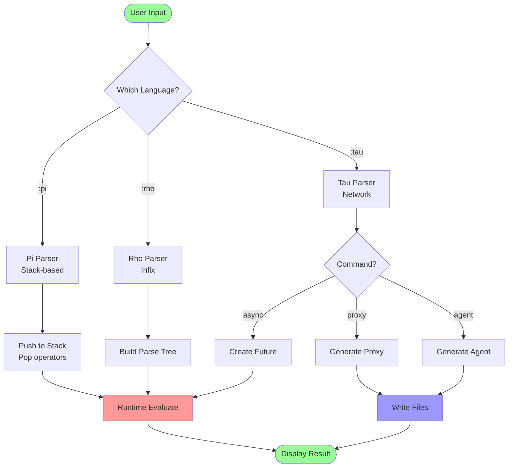

## Example Session
```
> :pi
Switched to Pi (postfix/RPN notation)
> 3 4 +
Num(7.0)
> :rho
Switched to Rho (infix with tab indentation)
> 3 + 4
Num(7.0)
> :tau
Switched to Tau (network language with futures)
> async fetch
Future(Pending)
> proxy "mycode.tsu"
Str("Proxy generated: mycodeProxy.h and App/Network/mycode.tsu")
```

## Project Structure

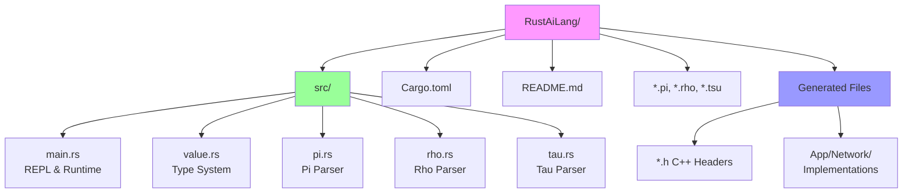

## Building and Testing

### Build the Project
```bash
cargo build          # Debug build
cargo build --release # Optimized build
```

### Run Tests
```bash
cargo test          # Run all 27 unit tests
```

### Test Coverage

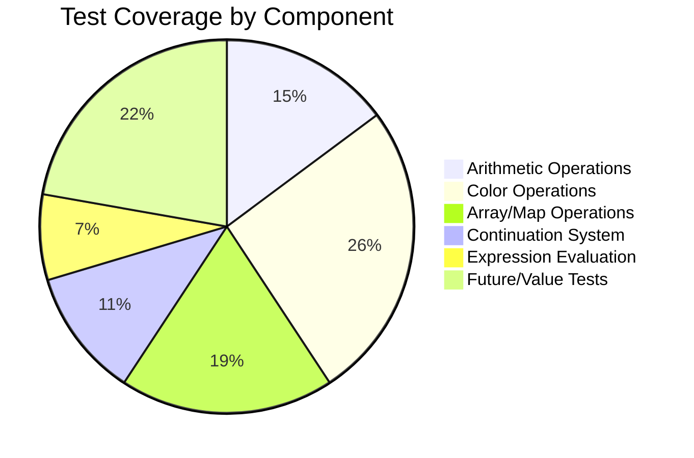

**Test Results:**
- ✅ 27 tests passing
- ✅ 0 failures
- Coverage: Runtime, Colors, Arrays, Maps, Continuations, Futures

## Advanced Features

### Continuation System

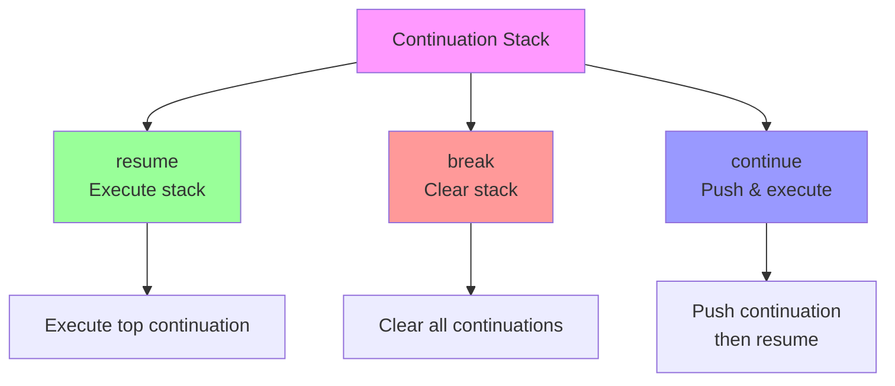

**Operations:**
- `resume` - Execute what's on the continuation stack
- `break` - Drop continuation stack and resume next
- `continue(f)` - Takes a continuation argument and executes it

### Future States

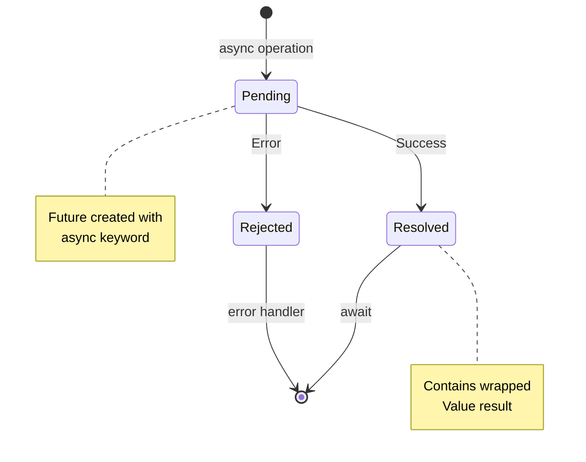

## Use Cases

### 1. Stack-Based Calculations (Pi)
- Forth-style programming
- RPN calculators
- Stack machine simulations

### 2. Natural Expressions (Rho)
- Mathematical computations
- Algorithm prototyping
- Familiar syntax for quick scripts

### 3. Network Code Generation (Tau)
- Proxy pattern generation
- Agent-based systems
- Async/await patterns
- Cross-language integration (Rust → C++)

## Contributing

1. Fork the repository
2. Create a feature branch
3. Add tests for new features
4. Ensure all tests pass: `cargo test`
5. Submit a pull request

## License

See LICENSE file for details.

---

**Version:** 0.2.0
**Languages:** Pi (`.pi`), Rho (`.rho`), Tau (`.tsu`)
**Status:** ✅ All 27 tests passing
